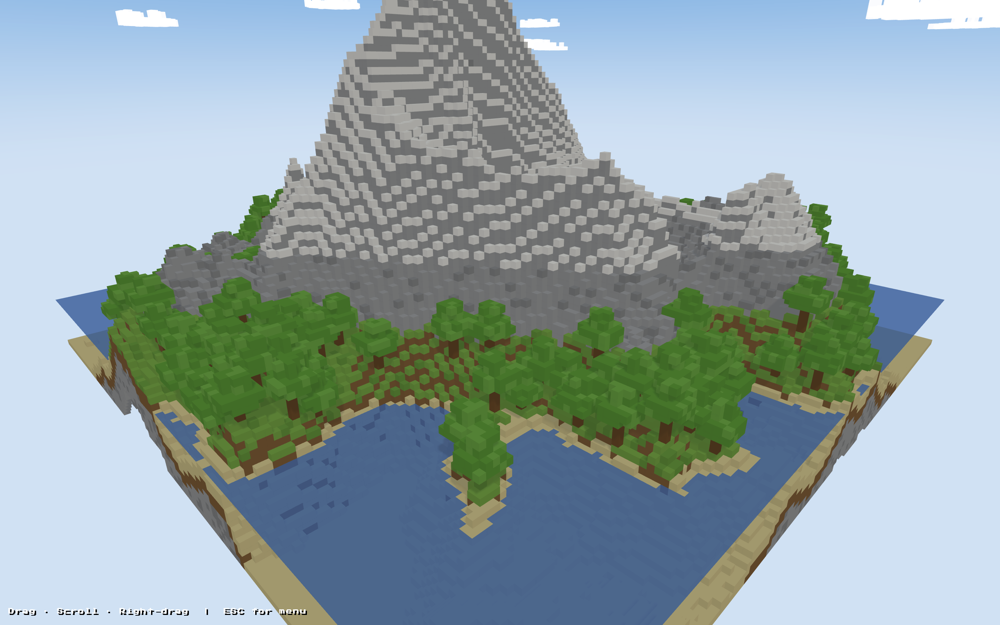

# Voxel World

A browser-based, Three.js procedural mountain & lake generator inspired by
Minecraft. The focus is the **scenery**, not the gameplay — open it, hit
"Create New World", and you get a deterministic voxel landscape with
ridged mountains, snow peaks, lakes, scattered trees, and drifting
clouds. The seed is persisted in `localStorage`, so the next time you
open the page the exact same world comes back.




## Run locally

No build step. Everything is ES modules + an import map; Three.js and
simplex-noise are pulled from CDN.

```sh
python3 -m http.server 8765
# then open http://localhost:8765
```

## Terrain generation

For each `(x, z)` column the integer height is

```
height(x,z) = 10
            + (mountainHeight + ridge2) × continent
            + hills + detail
            + basin                            # negative
            - borderFalloff
```

Each term comes from a different simplex 2D noise:

| Term         | Frequency | Purpose                                            |
| ------------ | --------- | -------------------------------------------------- |
| `continent`  | —         | Large dome — outer edges sink toward water         |
| `ridge`      | 0.011     | `(1 − \|noise\|)²` — sharp mountain spines         |
| `mask`       | 0.0055    | Gate where mountains can appear                    |
| `ridge2`     | 0.022     | Secondary higher-frequency peaks                   |
| `hills`      | 0.028     | Rolling terrain                                    |
| `detail`     | 0.12      | Per-block jitter                                   |
| `basin`      | 0.017     | Triggers below a threshold, carves lakes (negative)|

Once the heightmap is built, the renderer walks each column and emits
only **exposed** blocks (any neighbor lower / off-world), then picks
the block type by `y`:

| y range                              | Block             |
| ------------------------------------ | ----------------- |
| `y ≤ SEA_LEVEL + 1`                  | sand              |
| `SEA_LEVEL + 1 < y < STONE_EXPOSE`   | grass (top), dirt |
| `STONE_EXPOSE ≤ y < SNOW_LEVEL`      | bare stone        |
| `y ≥ SNOW_LEVEL`                     | snow              |

Trees are scattered on grass via random rolls with slope and spacing
checks. Clouds are ragged ellipsoid clusters at high y. Water is a
single horizontal `PlaneGeometry` per submerged column — **not a
transparent cube**, since cubes leak side faces through each other and
produce internal-block artifacts. Each block type becomes one
`InstancedMesh`; a 128×128 world ends up around 80 k instances in
≈ a dozen draw calls.

## Determinism

Same seed → same world.

- Seed seeds a `mulberry32` PRNG (`src/random.js`)
- Every `Math.random()` inside generators was replaced with `random()`
- `buildWorld(seed)` calls `setSeed(seed)` before anything else
- Generators consume the PRNG in a fixed order:
  1. 4× `createNoise2D` (terrain)
  2. solid blocks (color variation)
  3. trees
  4. water (no random)
  5. clouds

The seed is saved to `localStorage` under `voxel-world`. "Continue"
replays it, "Create New World" rolls a fresh one and overwrites.

> Caveat: same seed reproduces only against the **same code version**.
> Changing noise constants, generation order, or feature counts will
> produce a different world from the same seed — there is no built-in
> migration.

## How this differs from real Minecraft

| Dimension       | This repo                                  | Minecraft (1.18+)                                                                  |
| --------------- | ------------------------------------------ | ---------------------------------------------------------------------------------- |
| World           | Finite 128×128                             | Infinite, streamed in 16×16 chunks                                                 |
| Terrain field   | 2D heightmap                               | 3D density field (allows caves, overhangs)                                         |
| Noise system    | 4 stacked simplex                          | 6-axis multi-noise (temp / humidity / continentalness / erosion / PV / weirdness)  |
| Biomes          | Implicit by elevation                      | 70+ explicit biomes with their own terrain shapers                                 |
| Mountains       | Ridged noise                               | Dedicated PV + Erosion noise that produces realistic ranges                        |
| Caves           | None                                       | Cheese + spaghetti caves, aquifers, ravines                                        |
| Structures      | None                                       | Villages, temples, strongholds, ancient cities, etc.                               |
| PRNG            | mulberry32 (32-bit)                        | `java.util.Random` (legacy), Xoroshiro128++ (1.18+); per-chunk subseeds            |
| Pipeline        | One pass: noise → mesh                     | Biome → shape → surface → carve → ore → feature → decorate                         |

This is roughly what Minecraft Alpha (2009–2010) did — 2D heightmap +
noise — with modern lighting, instancing, and a saner UI.

## Project layout

```
index.html
src/
├── main.js          entry, menu lifecycle, render loop
├── config.js        constants (size, sea level, fog, counts)
├── random.js        seeded mulberry32 PRNG
├── storage.js       localStorage persistence
├── menu.js          menu controller + splash text
├── scene.js         renderer / camera / lights / sky dome
├── materials.js    geometry + material dictionary
├── terrain.js       noise functions + heightmap
├── blocks.js        block-type lookup + exposed-face culling
├── world.js         orchestrator → InstancedMeshes
└── features/
    ├── water.js
    ├── trees.js
    └── clouds.js
```

Each feature module is a pure function returning
`Array<{x, y, z, type}>`. Adding a new biome / decoration is:

1. Add a material entry to `src/materials.js`
2. Drop a generator in `src/features/` returning typed blocks
3. Register it in the `sources` array in `src/world.js`

The rest (instancing, shadow flags, transparency ordering) is
handled centrally.

## Controls

- **Drag** — orbit
- **Scroll** — zoom
- **Right-drag** — pan
- **ESC** — open menu (after a world is loaded)

## Tech stack

- [Three.js](https://threejs.org/) `0.160`
- [simplex-noise](https://github.com/jwagner/simplex-noise.js) `4.0.3`
- Plain ES modules + import maps. No bundler, no `package.json`.
