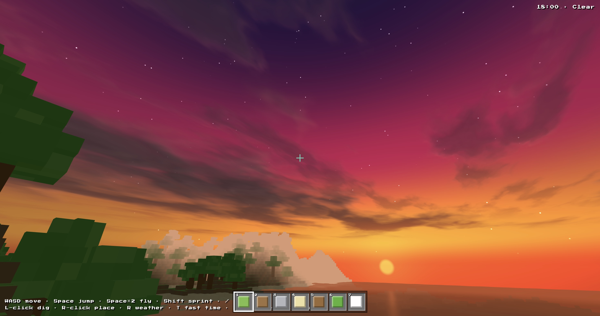
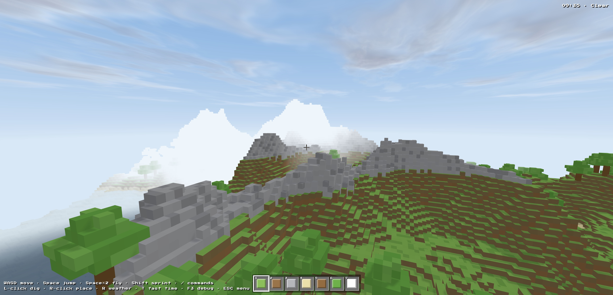
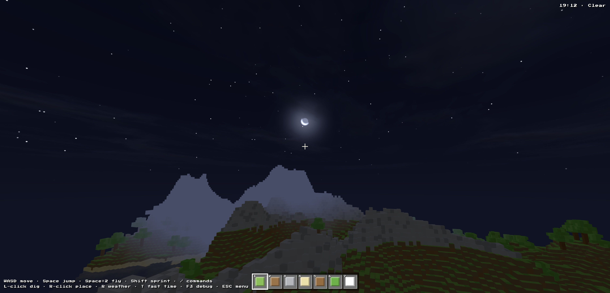

# Voxel World

An infinite, first-person Minecraft-like that runs entirely in the browser —
no bundler, no build step, just ES modules and an import map. A continent-scale
world streams in around you chunk by chunk, with a full day/night cycle,
dynamic weather, and shader-driven sky, clouds and water.



| | |
| --- | --- |
|  |  |

```sh
python3 -m http.server 8765   # then open http://localhost:8765
```

> Tech stack: [Three.js](https://threejs.org/) `0.160` + [simplex-noise](https://github.com/jwagner/simplex-noise.js) `4.0.3`, loaded from CDN via an import map. Plain ES modules — no `package.json`, no toolchain.

---

This README is about **how it works**. Controls are at the [bottom](#controls).

## 1. Terrain generation

The world is unbounded: there is no map, no border, no island. Terrain is a
pure function `heightAt(x, z) → surfaceY` defined for every integer column, and
chunks evaluate it on demand. It is built by layering several bands of
simplex noise at very different frequencies (`src/terrain.js`):

```
continentalness   3 octaves @ ~600-block wavelength   → oceans vs landmass
base elevation    ocean floor (~3) → coastal plain (~14)
mountains         ridged noise², gated by a mask, only well inland
hills + detail    rolling mid-frequency + per-block jitter
basins            negative dips that carve inland lakes
```

The keystone is **continentalness** — a near-DC noise that decides, over
hundreds of blocks, whether you're over deep ocean or a landmass. Everything
else is gated through it via a `land` factor (`smoothstep(-0.22, 0.18, c)`), so
mountains only erupt well inland, hills flatten out over water, and coastlines
emerge naturally where `land` crosses sea level:

```js
let c = nCont(x*0.0016, z*0.0016)              // continents
      + 0.50*nCont(x*0.0032+71, z*0.0032-19)   // bays / peninsulas
      + 0.25*nCont(x*0.0064-133, z*0.0064+57); // coastal wiggle
const land = smoothstep(-0.22, 0.18, c / 1.75);

let h = 3 + land * 11;                          // ocean floor → plains
```

Mountains use **ridged noise** — `pow(1 - abs(noise), 2)` turns the smooth
zero-crossings of simplex into sharp crests, giving mountain *ranges* with
spines and valleys instead of round lumps. Two octaves stack a tall primary
spine with finer secondary ridges, and the whole contribution is multiplied by
a low-frequency `mask` so ranges cluster instead of covering every landmass.

A second noise field, `forestAt(x, z)`, drives tree density so woods form
clumps rather than a uniform scatter. Trees themselves are placed
**deterministically per column** (`src/trees.js`): whether a tree stands at
`(x, z)` is decided purely by a coordinate hash plus the terrain — so any chunk
can independently decide which trees from neighbouring columns spill across its
border, with no ordering or shared state.

Determinism comes from a single seeded **mulberry32** PRNG (`src/random.js`).
The five noise generators draw their permutation tables from it in a fixed
order at world creation, so one seed always reproduces the same planet — which
is the whole reason the save file can be just a seed (see §3).

## 2. Coordinate systems

Three coordinate spaces, with deliberately cheap conversions between them:

| Space | Units | Used by |
| --- | --- | --- |
| **World** | floats, metres = blocks | camera, player, raycasts, mesh vertices |
| **Voxel** | integers, one per block | the voxel grid, edits, block lookups |
| **Chunk** | integers, one per 16×16 column region | streaming, the chunk cache |

The single design decision that makes everything else simple: **voxel cell
`(x, y, z)` occupies world-space `[x, x+1)` on each axis.** A block's render
cube spans exactly from its integer corner, so:

```
world → voxel:   Math.floor(worldX)            // no half-block offset, ever
voxel → chunk:   Math.floor(voxelX / 16)
world → chunk:   Math.floor(worldX / 16)
```

There's no centring transform, no `+0.5` fudge. The mesher emits vertex
positions directly in world coordinates, so chunk meshes need **no model
matrix** and frustum-cull on their own bounds. The DDA block raycast
(`src/interact.js`) and the player's AABB collision (`src/player.js`) both start
from `floor(camera.position)` and step in integer voxel space.

Inside a chunk, the voxel array is indexed **Y-contiguous**:

```js
const idx = (lx, y, lz) => (lx * CHUNK + lz) * WORLD_HEIGHT + y;
```

so a vertical column is one contiguous run — the mesher scans columns
bottom-to-top and a per-column `colMax` bounds the scan to the highest filled
voxel, skipping the empty sky above.

## 3. Persistence

Because terrain is a deterministic function of the seed (§1), the save file
never stores blocks that the generator can reproduce. It stores the seed plus
**your delta** (`src/storage.js`, localStorage, v2 format):

```js
{ version: 2, seed, savedAt,
  time, weather,                                   // resume the same moment
  player: { x, y, z, yaw, pitch, flying },         // and the same spot
  edits: { "x,y,z": blockId, ... } }               // every block you changed (0 = dug)
```

A typical explored-and-built world is a few kilobytes.

The interesting part is the **edit overlay** (`src/world.js`). Edits can't live
in the chunk cache, because chunks are evicted and regenerated as you roam — a
regenerated chunk would wipe your build. So edits are kept in a separate
authoritative map, keyed by chunk, that outlives any single chunk:

```js
const edits = new Map();   // "cx,cz" → Map("x,y,z" → blockId)
```

Every `set()` records into it; every time a chunk's voxel data is generated,
the overlay is **re-applied on top** of the freshly-generated blocks. The
result: a build survives leaving render distance, the cache filling up and
evicting it, and a full page reload — all reconstructed from `seed + overlay`.
`exportEdits()` flattens the per-chunk maps into the flat `{"x,y,z": id}`
dictionary for the save.

Autosave runs every 2 s (guarded by an `editsVersion` counter so it's a no-op
when nothing changed) and once more on `pagehide` / tab-hidden, so closing the
tab never loses progress.

## 4. Rendering & shaders

### Chunk meshing

Each 16×16 chunk is **one vertex-coloured mesh** containing only its *exposed*
block faces — a single draw call per chunk (`src/mesher.js`). For every solid
voxel, each of its six faces is emitted only if the neighbour in that direction
is air; neighbours across a chunk border are resolved through a world-space
`getBlock()` so seams between chunks are watertight. Faces sample one of three
colour slots — `[top, side, bottom]` — letting grass and snow keep the classic
bright-top / dirt-side look, and a per-voxel hash jitters brightness ±3.5% for a
hint of texture. No per-block meshes, no instancing, no textures.

Streaming (`src/world.js`) runs on a small per-frame budget: it generates voxel
data in a ring one chunk *wider* than the visible meshes (so border faces always
see real neighbours), meshes a couple of ready chunks nearest the player, and
drops meshes that fall outside the ring. Distance fog is tuned as a steep band
right at the view limit, so the chunk-loading edge dissolves into the sky
instead of washing out the midground.

### Sky (`src/sky.js`)

A single shader-dome inside-out sphere, driven by one `timeOfDay` value (a full
cycle is 4 minutes). The fragment shader composites, back to front: a day/night
vertical gradient blended by sun elevation; a banded **sunset gradient** that
washes over the whole sky at dusk (red-orange horizon line → amber band →
vivid magenta → deep violet zenith); analytic **sun and moon discs** (the moon gets a crescent bite by
subtracting an offset disc) with glows; and hash-based **twinkling stars** on a
slowly-rotating sky direction that fade in as the sun sets. One
shadow-casting directional light tracks the sun by day and the moon by night,
and the light/ambient/fog colours are all resolved on the CPU from the same
cycle so the rest of the scene stays in sync.

### Clouds (`src/clouds.js`)

Two camera-following planes (a billowing deck + higher, faster cirrus) painted
with **domain-warped fBm** — fBm whose input is offset by another fBm, which
breaks up the grid and gives soft, organic, non-repeating shapes. Coverage
slides a density threshold from scattered wisps to a solid storm deck. A second
density sample *towards the sun* fakes self-shadowing (lit tops, shaded
undersides), thin sun-facing edges pick up a silver lining that warms to
orange-pink at dusk, and distant cloud melts into the horizon haze for aerial
perspective.

### Water (`src/water.js`)

A calm, painterly surface (one shared `ShaderMaterial`; each chunk contributes a
quad per submerged column carrying a per-vertex **depth** attribute). The look
deliberately avoids tiling sine-wave stripes: the surface variation is large,
slow, domain-warped fBm producing soft tonal patches (±5% brightness), and the
normals come from the *same* warped field so there's never a visible repeat.
Depth tints the colour (hazy shallows → darker deep water), a gentle Fresnel
term reflects the sky/horizon, and a restrained sun-glint survives for sunsets.
Rain roughens the normals; all colours track the day/night/weather state, so the
water goes orange at dusk and dark at night with the rest of the scene.

### Weather (`src/weather.js`)

A five-state machine — `clear · cloudy · rain · storm · snow` — that picks a new
state on a timer and *lerps* every parameter (cloud cover, fog density, gloom,
precipitation) so transitions are smooth. Rain and snow are GPU point sprites in
a world-anchored box around the camera; storms drive random lightning flashes
that bleed into the sky, clouds and ambient light.

## Project layout

```
index.html         HUD / menu / console / debug DOM + styles + import map
src/
├── main.js        entry: wiring, pointer lock, autosave, render loop
├── config.js      constants (chunk size, sea level, day length, player)
├── random.js      seeded mulberry32 PRNG
├── terrain.js     unbounded continental height + forest fields
├── blocks.js      block ids, coordinate hash, surface→block rules
├── trees.js       deterministic per-column trees
├── world.js       chunk cache, streaming, edit overlay, persistence glue
├── mesher.js      chunk → one vertex-coloured mesh + water quads
├── materials.js   per-face block colours, shared solid material
├── sky.js         sky-dome shader, sun/moon/stars, light rig, fog
├── clouds.js      domain-warped fBm cloud layers
├── water.js       painterly water shader
├── weather.js     weather state machine + rain/snow particles
├── shaders.js     shared GLSL (hash, value-noise, fBm)
├── player.js      pointer lock, movement, AABB collision, swim/fly
├── interact.js    DDA voxel raycast, dig/place, block highlight
├── debug.js       F3 overlay (position, facing, targeted block, FPS)
├── hud.js         hotbar + status line
├── console.js     `/` command console
├── menu.js        main menu + splash text
└── storage.js     localStorage save/load (v2)
```

## Controls

| Input | Action |
| --- | --- |
| Mouse | Look (click canvas to capture pointer) |
| WASD / Space / Shift | Move / jump / sprint |
| Space ×2 | Toggle creative flight (no height limit) |
| Left / Right click | Dig / place block |
| 1–7, wheel | Select hotbar block |
| `/` | Command console |
| R · T | Cycle weather · hold to fast-forward time |
| F3 | Debug overlay |
| ESC | Menu |

### Commands

```
/time set <day|noon|sunset|night|HH:MM|ticks>   /time add <ticks>
/timescale <n>          day-cycle speed (0 freezes)
/weather <clear|cloudy|rain|storm|snow>         /weather lock | unlock
/tp <x> <z> | <x> <y> <z> | spawn
/fly        /renderdistance <2-12>        /seed        /help
```
