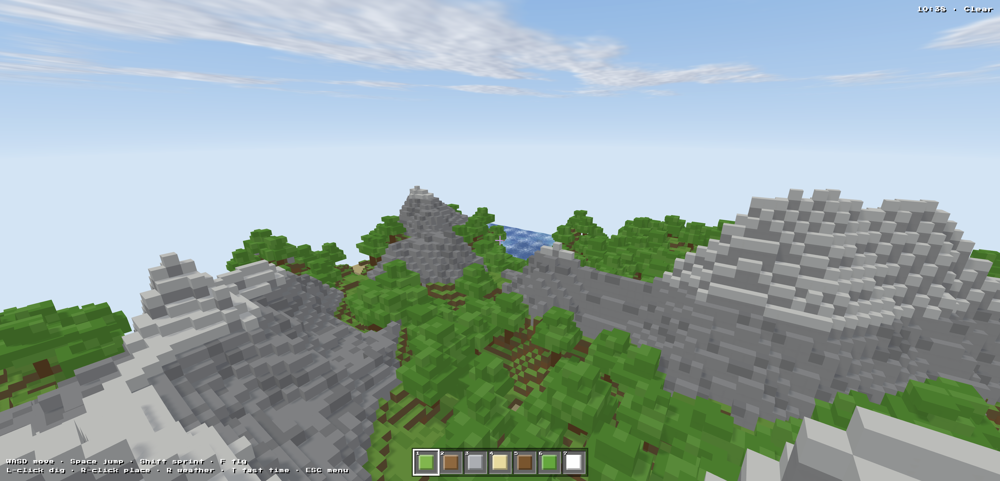
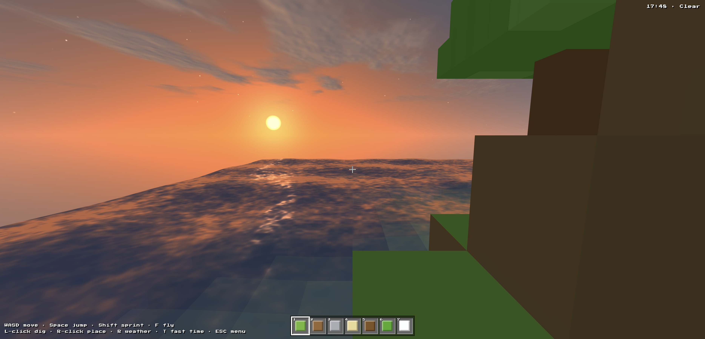
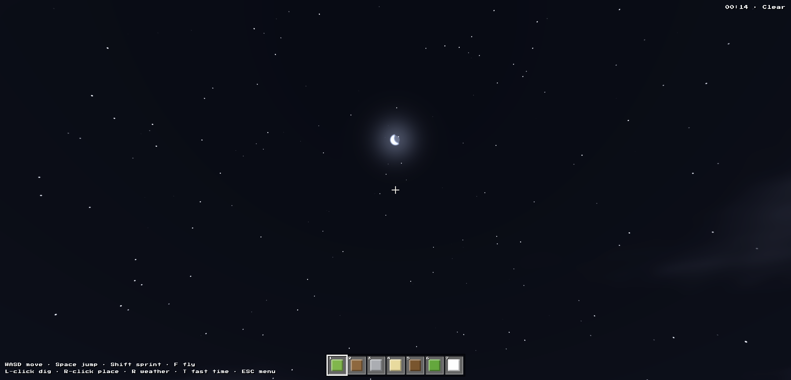
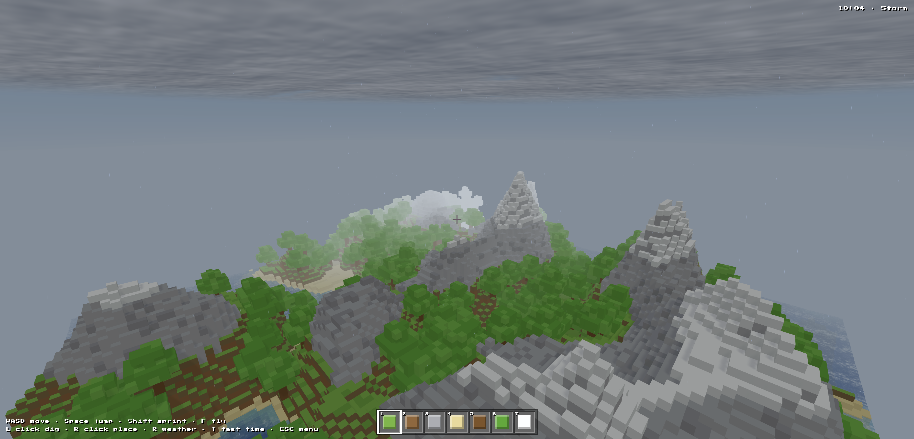
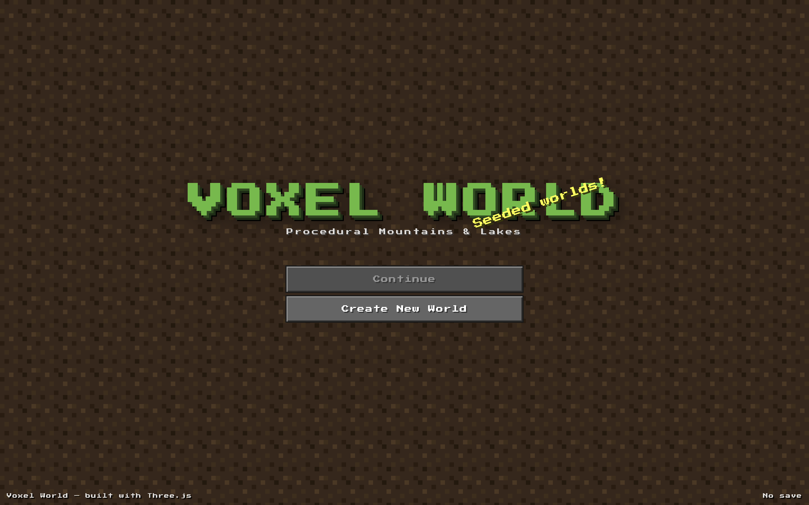

# Voxel World

A browser-based, first-person Minecraft-like built with Three.js — no
bundler, no build step. Walk, dig and build in a procedural voxel world
with a full day/night cycle, dynamic weather, shader clouds and shader
water. The focus is **atmosphere**: sun and moon light, dusk glow, stars,
rain, snow, lightning, and lakes that catch the sunset.



| | |
| --- | --- |
|  |  |
|  |  |

## Run locally

Everything is ES modules + an import map; Three.js and simplex-noise are
pulled from CDN.

```sh
python3 -m http.server 8765
# then open http://localhost:8765
```

## Controls

| Input | Action |
| --- | --- |
| Mouse | Look (pointer lock — click the canvas to capture) |
| WASD | Move |
| Space | Jump / swim up |
| Shift | Sprint (descend while flying) |
| F | Toggle fly mode |
| Left click | Dig block |
| Right click | Place block |
| 1–7 / wheel | Select hotbar block |
| R | Cycle weather |
| T (hold) | Fast-forward time |
| ESC | Menu |

## The sky system (`src/sky.js`)

One shader dome + one light rig, all driven by a single `timeOfDay`
value (a full cycle takes 4 minutes):

- **Gradient sky** — separate day/night vertical gradients, blended by
  sun elevation.
- **Sun & moon** — shader discs (the moon has a crescent bite), with a
  warm dusk glow that hugs the horizon around the sun's azimuth at
  sunrise/sunset.
- **Stars** — hashed cells on a slowly rotating sky direction, with
  per-star twinkle, fading in at night.
- **Lighting** — one shadow-casting directional light plays the sun by
  day and the moon by night; ambient/hemisphere intensities, fog color
  and fog distance all track the same cycle (and the weather).
- **Lightning** — the weather system spikes a flash uniform that bleeds
  into the sky, the clouds and the ambient light.

## Weather (`src/weather.js`)

A five-state machine — `clear · cloudy · rain · storm · snow` — that
picks a new state every 45–90 s and *lerps* every parameter (cloud
cover, gloom, fog density, precipitation) so transitions roll in
smoothly. Rain and snow are GPU point sprites wrapped in a
world-anchored box around the camera: rain renders as vertical streaks,
snow as soft drifting flakes, both dimmed at night. Storms add lightning
flashes on a random timer.

## Clouds (`src/clouds.js`)

A single large plane at y = 85 that follows the camera. The fragment
shader draws 5-octave fbm value noise, drifting with time and slightly
stretched along the wind for a windswept look. The weather's `cover`
parameter slides the density threshold from scattered cirrus to a solid
storm deck, and a second noise sample toward the sun fakes lit tops /
shaded undersides. Cloud color tracks daylight, dusk and storm gloom.

## Water (`src/water.js`)

One merged mesh of per-column quads with a per-vertex **depth**
attribute (sea level − terrain height):

- **Waves** — vertex displacement from layered sines; the fragment
  shader re-derives the analytic normal and adds fbm ripples (amplified
  while it rains).
- **Color by depth** — turquoise shallows → deep blue, dimming at night.
- **Fresnel reflection** — glancing angles reflect the horizon color,
  including the dusk glow, so lakes turn orange at sunset.
- **Specular** — a tight sparkle plus a broad lobe that stretches into a
  glitter path when the sun or moon sits low.
- **Foam** — animated noise band where the water column is shallow
  (shorelines).

Being underwater switches to dense blue fog plus a screen tint, and
swimming kicks in (slower movement, Space to float up).

## World & interaction

- **Voxel field** (`src/voxels.js`) — a full `128×100×128` `Uint8Array`
  of block ids built from the heightmap + trees, so digging always
  reveals real blocks. Color variants (dark grass etc.) come from a
  coordinate hash, stable across edits.
- **Chunked meshing** (`src/chunks.js`) — the world renders as 8×8
  chunks of `InstancedMesh`es (one per block type per chunk); a block
  edit re-meshes only the touched chunk (~2 ms), not the world. Grass
  and snow blocks use a 3-group cube geometry — `[sides, top, bottom]`
  — for the classic green-top/dirt-side look.
- **Targeting** (`src/interact.js`) — an Amanatides & Woo DDA raycast
  walks the voxel grid from the camera; the hit block gets an outline,
  left-click clears it, right-click places the hotbar block against the
  hit face (refused if it would intersect the player).
- **Player** (`src/player.js`) — AABB vs voxel collision resolved per
  axis, gravity + jumping, swimming in water columns, fly mode.

## Terrain generation

Unchanged from the original scenery generator — ridged simplex spines
gated by a mountain mask over a continent dome, plus hills, detail
jitter and negative basins that carve lakes (see git history for the
full noise table). Same seed → same world; the seed is persisted in
`localStorage` and consumed by a shared `mulberry32` PRNG in a fixed
order (terrain noise, then trees).

## Project layout

```
index.html           HUD/menu DOM + styles + import map
src/
├── main.js          entry: wiring, pointer lock, render loop
├── config.js        constants (sizes, sea level, day length, player)
├── scene.js         renderer + camera
├── sky.js           sky dome shader, sun/moon/stars, light rig, fog
├── clouds.js        fbm cloud plane
├── water.js         wave/fresnel/foam water mesh
├── weather.js       weather state machine + rain/snow particles
├── voxels.js        voxel field (ids, fill from heightmap + trees)
├── chunks.js        chunked InstancedMesh builder + re-meshing
├── player.js        pointer lock, movement, collision, swim/fly
├── interact.js      DDA raycast, dig/place, block highlight
├── hud.js           hotbar, status line
├── world.js         orchestrator: voxels + chunks + water + spawn
├── terrain.js       noise functions + heightmap
├── materials.js     grouped cube geometry + material dictionary
├── menu.js          menu controller + splash text
├── storage.js       localStorage persistence
├── random.js        seeded mulberry32 PRNG
└── features/
    └── trees.js     tree generator
```

> Block edits are not persisted — only the seed is saved, so a reload
> regenerates the pristine world.

## Tech stack

- [Three.js](https://threejs.org/) `0.160`
- [simplex-noise](https://github.com/jwagner/simplex-noise.js) `4.0.3`
- Plain ES modules + import maps. No bundler, no `package.json`.
